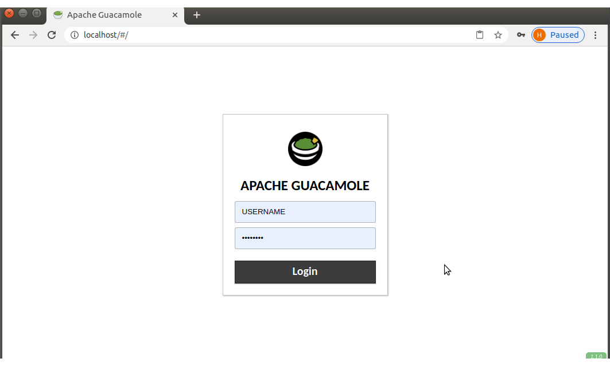
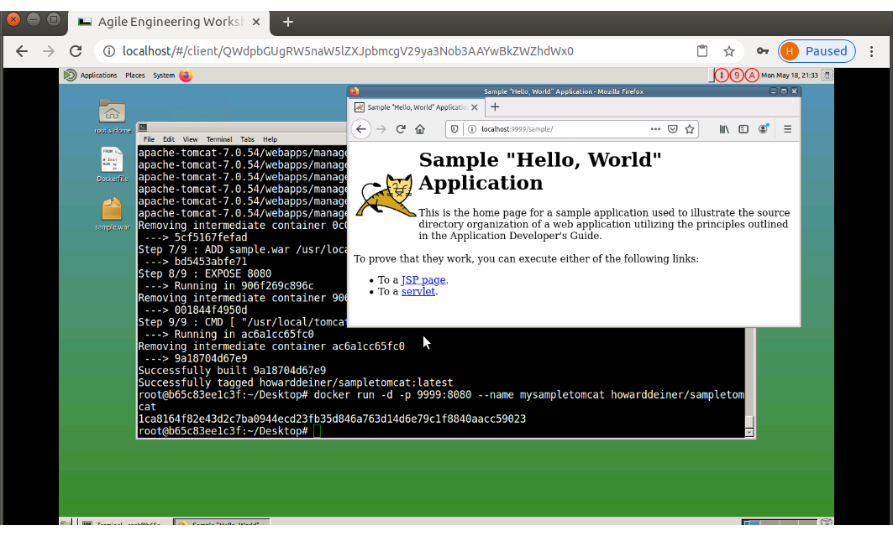
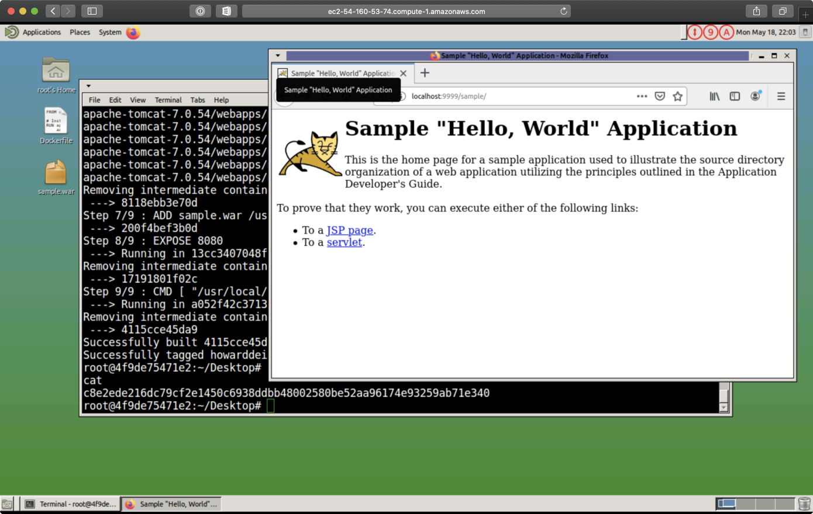

### Using Docker and AWS to Teach Docker

##### Concept
A need arose to teach Docker to a team that had restricted network access and no control of their local machines that they are supposed to do development from. 

We could either go the corporate route, open tickets, seek approvals, and wait weeks on end, or we can demonstrate a DevOps Cultural perspective.  That is, if we don't have it, and can't wait on dependencies (and exactly who has time for that), we build our way out of the situation.  Of course, I want to demonstrate that perspective.

So what we have here gives people with a browser and HTTP port 80 access an Unbuntu system to log on to and learn Docker from.

##### Explaining the scripts
###### step_1_build_image.sh
Very simple invocation of docker to build and then push the desired Docker image, as defined in the Dockerfile, to DockerHub.  

We first remove any local image of that we may have cached.  Then we login to DockerHub.  Next, we do the build itself from our Dockerfile.  And finally, we push the image to Dockerhub.

Of course, there is true magic is in the image, which starts from an Ubuntu 16.04 server, adds in all of the X based inactive things that people enjoy, uses the Apache Guacamole project to run a tightvnc server over a Tomcat server, and serve as a rather advanced example of what's possible with Docker.
```bash
./step_1_build_image.sh 
Untagged: howarddeiner/ubuntu-for-desktops:latest
Untagged: howarddeiner/ubuntu-for-desktops@sha256:9ff47791d6d8e29861e68cbff00d8cd32ba4839c8eee10ef5928e5362958816e
Deleted: sha256:83b59254d09661659744acb65eed3143c3cbcb6d15d0bbdb98e74bf6038234cf
Deleted: sha256:8b92d7c4ecb2b5a3029cda83f447dea90cc6ef3c2acd5e03a5f0056200c66804
Deleted: sha256:ecbf526f5cb503f775af0a2d9b27b712f788a4c7d915578de958e6efed64f877
Deleted: sha256:ba2faed9cfa44ea36de69e6c9919a4e728c5d1f4a62848a81a84af5db5b2fb07
Deleted: sha256:a078ed230d511a1f7b7a8b0260698d970e7cc057be4346b0721268f6f318c96d
Deleted: sha256:31dff38f3bf6d3ca55ef590af7865cc16b8f6ad457d862aaf4b22cece47e6088
Deleted: sha256:35fbc28e12f591898cf397929b6bd6b7d871b511d68e3329e98b751d929d8e55
Deleted: sha256:31edb936966b42e2186e5e309b859a46841b329b62f0250c78bff9aaef311ab9
Deleted: sha256:c88667370d2ecab26d254abc9ac2eedc74be29782a17dff30013d781dbcca54f
Deleted: sha256:5ef83dd2ad7aa9d3b90019d83d261c51a58de7423122a2f6536c7b45f604783a
Deleted: sha256:c32d6edfcf6bb5f3c64ed33512a7a9decdf3d0a5c49cbb59f1fc1b2f2f946c67
Deleted: sha256:a8b8d1e09e73964a07fc69a2926efd467520bf5d34dc485e81782529fd5a3561
Deleted: sha256:5c8fee0307c3fc244a4b3f94ce9abcbb46160f4aae2bfd8f148824f29b7fecb9
Deleted: sha256:b7e9a79b21b75183e1d70e0277cb5937069d12f889bfed09df85e2a9828c880d
Deleted: sha256:8d5531f133b92bda008b2358555f8ddae3201eff5fc9257c00e6332fae775ff9
Deleted: sha256:fcb95489c84c28526da667603fe940972d650efeab72f0fe1cc5a892a70d79b5
Deleted: sha256:d97bbeaae95a1caa243e304c55ce39fda4ffb7e07b299b18a7bacb3dc3312173
Deleted: sha256:751b2b685adfc459faf23ffbcdf66610fe22b5bba2fd5904a920c74288c1da56
Deleted: sha256:9e141a89b49409ce5bdd0b909f5f629313a6e61bc619278d5eee6da5b366a365
Deleted: sha256:2218d13f4cff056b8fc57f45ce1e2e1b1047c174f7bde1440872692a97beca9f
Deleted: sha256:fa4e719a18da946130e64fcd5ecc1de702e55217b3687a89ed162378e30c92ed
Deleted: sha256:ec283448e3dff63219b09a4306a8c10b8210dbc7f84b1b32ed211122614e1ec2
Deleted: sha256:8954957a5c4624c3132251a713235063c1b7399cc37d660765ac56aab2137330
Deleted: sha256:66e4ef663f347f8f42de4caeaa13754353afb6a7c6cbd24f1e602d95db299ea0
Deleted: sha256:f840569b64b8708a4944c105354dcf700e2f2c9e67b64d7545e00d1eafd075bb
Deleted: sha256:d4195254c18e6797162216f6062c90970e03bc2c760b308f3b06264945ec82b4
Deleted: sha256:4cceed70b26a07f797b40825f6ba691357b76561459b8896ba50b4f60acea462
Deleted: sha256:988894f0c5e4429f86b8a5bbd9ba29600dea06da075bf3a779ab765b289f4f24
Deleted: sha256:0ca6f5aa35432a3ae128ed3a51a665bda185ff19721331b62539706b99e02f47
Deleted: sha256:5debb7b7aba62ab58fad283028b481eea5b815fc1d8b2c26ac88a6372dfd4e31
Deleted: sha256:8bb3d213340b78cb5b81e31d6592027cfa91184de3568c93377136361448354c
Deleted: sha256:b4da03d066d881a446c48cb6778bfc98a3445081e37aeb291067a5e90f81d9ff
Deleted: sha256:e0ffa7c2ce0048df4222dda3ebd24740442b8a9048ab87cb8e229f253de71f43
Deleted: sha256:c25fb7875bf50ef8eefbfdedc49e9e541a295b122d6211d4f07584117a08d3c7
Deleted: sha256:2106acfbb734ab7b1c5158c88ad808d9c013c7338096b7106d400b4c95989366
Authenticating with existing credentials...
WARNING! Your password will be stored unencrypted in /home/howarddeiner/.docker/config.json.
Configure a credential helper to remove this warning. See
https://docs.docker.com/engine/reference/commandline/login/#credentials-store

Login Succeeded
Sending build context to Docker daemon  153.7MB
Step 1/19 : FROM ubuntu:16.04
 ---> 005d2078bdfa
Step 2/19 : RUN DEBIAN_FRONTEND=noninteractive apt-get -y update  && DEBIAN_FRONTEND=noninteractive apt-get -y install build-essential libcairo2-dev libjpeg-turbo8-dev libpng12-dev libossp-uuid-dev  && DEBIAN_FRONTEND=noninteractive apt-get -y install libavcodec-dev libavutil-dev libswscale-dev libfreerdp-dev libpango1.0-dev  && DEBIAN_FRONTEND=noninteractive apt-get -y install libssh2-1-dev libtelnet-dev libvncserver-dev libpulse-dev libssl-dev  && DEBIAN_FRONTEND=noninteractive apt-get -y install libvorbis-dev libwebp-dev tomcat8 freerdp ghostscript jq wget curl  && DEBIAN_FRONTEND=noninteractive apt-get -y install tightvncserver  && DEBIAN_FRONTEND=noninteractive apt-get -y install xfce4 xfce4-goodies  && DEBIAN_FRONTEND=noninteractive apt-get -y install gnome-icon-theme-full tango-icon-theme  && DEBIAN_FRONTEND=noninteractive apt-get -y install firefox  && DEBIAN_FRONTEND=noninteractive apt-get -y install mate-desktop-environment
 ---> Running in 056cf8294565

[...]

Step 16/19 : ADD _sample-DockerFile /root/Desktop/Dockerfile
 ---> 0236f7f06e45
Step 17/19 : ADD _sample-sample.war /root/Desktop/sample.war
 ---> d74b08949084
Step 18/19 : RUN sed -i 's/80/90/g' /etc/tomcat8/server.xml
 ---> Running in 1f18425cb52a
Removing intermediate container 1f18425cb52a
 ---> 9e052568316d
Step 19/19 : CMD service tomcat8 start ; service docker start ; guacd ; USER=root && export USER &&  tightvncserver :1 -geometry 1280x768 -depth 16 && sleep 999d
 ---> Running in dae378dcb4a4
Removing intermediate container dae378dcb4a4
 ---> a05f3a10d6a1
Successfully built a05f3a10d6a1
Successfully tagged howarddeiner/ubuntu-for-desktops:latest
The push refers to repository [docker.io/howarddeiner/ubuntu-for-desktops]
e3108b16b3d2: Pushed 
c343583ef0fe: Pushed 
ef41385a8c9d: Pushed 
6973ee02b005: Pushed 
9de5e595700b: Pushed 
8b4bad78b824: Pushed 
635e373e78ac: Pushed 
8363c4b45cf7: Pushed 
9eaddabf26b4: Pushed 
0543b635fe44: Pushed 
52a267c4e48e: Pushed 
b19e8f407a4e: Pushed 
5eb380ce8fc6: Pushed 
106270bd1e0e: Pushed 
ed1de3e280f7: Pushed 
637b9353b68a: Layer already exists 
655ed0b8a84e: Pushed 
64d2e4aaa54c: Layer already exists 
0d3833376c2f: Layer already exists 
4a048ea09024: Layer already exists 
b592b5433bbf: Layer already exists 
latest: digest: sha256:770c8f4634f98e96ff402ac9bf994d8124b16ecdab539a4fc46b59e2bfee432d size: 4699
```
###### step_2_test_locally_if_needed.sh
This script allows us to try out our image before we go on to deploy it.

The issue here is that this script is intended to allow students to practice usinf Docker to learn about the commands.  This can present issues to the Docker Daemon, as it is presumed to be the client of Docker, but not the server AND the client.  This is an issue that you will run into when running a Docker based Jenkins from a Docker image, and you expect to do things like build and test new Docker images.  The current way that this is handled thesse days is with the Docker supplied docker:dind image, and then starting the desired container inside the docker_server container.
```bash
./step_2_test_locally_if_needed.sh 
91492dec143e2606cf3d9bc8726342826b04b204d9dab68573529c57bb51cebe
When you're done, don't forget to:
Control-C and then docker stop docker_server
Unable to find image 'howarddeiner/ubuntu-for-desktops:latest' locally
latest: Pulling from howarddeiner/ubuntu-for-desktops
e92ed755c008: Pulling fs layer
b9fd7cb1ff8f: Pulling fs layer
ee690f2d57a1: Pulling fs layer
53e3366ec435: Pulling fs layer
72bdfb1e771a: Pulling fs layer
a30993142df2: Pulling fs layer
12b40483ee49: Pulling fs layer
76f515184125: Pulling fs layer
d244ef5817d6: Pulling fs layer
99ce1c747446: Pulling fs layer
63af16ced4fa: Pulling fs layer
00ae915f7a43: Pulling fs layer
2458f3e7c9a9: Pulling fs layer
c7c5c0e4214f: Pulling fs layer
695bdb917e55: Pulling fs layer
26d649cba913: Pulling fs layer
9845951ed368: Pulling fs layer
75e6e061b9f2: Pulling fs layer
2e071ad6b349: Pulling fs layer
d5a4c7408105: Pulling fs layer
bde9c32000e3: Pulling fs layer
53e3366ec435: Waiting
2458f3e7c9a9: Waiting
c7c5c0e4214f: Waiting
72bdfb1e771a: Waiting
695bdb917e55: Waiting
a30993142df2: Waiting
26d649cba913: Waiting
12b40483ee49: Waiting
76f515184125: Waiting
9845951ed368: Waiting
75e6e061b9f2: Waiting
d244ef5817d6: Waiting
99ce1c747446: Waiting
63af16ced4fa: Waiting
00ae915f7a43: Waiting
2e071ad6b349: Waiting
d5a4c7408105: Waiting
bde9c32000e3: Waiting
ee690f2d57a1: Download complete
b9fd7cb1ff8f: Verifying Checksum
b9fd7cb1ff8f: Download complete
53e3366ec435: Verifying Checksum
53e3366ec435: Download complete

[...]

72bdfb1e771a: Pull complete
a30993142df2: Pull complete
12b40483ee49: Pull complete
76f515184125: Pull complete
d244ef5817d6: Pull complete
99ce1c747446: Pull complete
63af16ced4fa: Pull complete
00ae915f7a43: Pull complete
2458f3e7c9a9: Pull complete
c7c5c0e4214f: Pull complete
695bdb917e55: Pull complete
26d649cba913: Pull complete
9845951ed368: Pull complete
75e6e061b9f2: Pull complete
2e071ad6b349: Pull complete
d5a4c7408105: Pull complete
bde9c32000e3: Pull complete
Digest: sha256:770c8f4634f98e96ff402ac9bf994d8124b16ecdab539a4fc46b59e2bfee432d
Status: Downloaded newer image for howarddeiner/ubuntu-for-desktops:latest
 * Starting Tomcat servlet engine tomcat8
   ...fail!
 * Starting Docker: docker
   ...done.
guacd[112]: INFO:	Guacamole proxy daemon (guacd) version 1.1.0 started
xauth:  file /root/.Xauthority does not exist

New 'X' desktop is 91492dec143e:1

Starting applications specified in /root/.vnc/xstartup
Log file is /root/.vnc/91492dec143e:1.log
```
Pointing broswer at localhost, enter USERNAME and PASSWORD for credentials.


You should be able to do all of the exercises in the "2020.05.08 Gaining Confidence With Docker Container.pptx" presentation.  For example, 


###### step_3_build_infrastructure
This is also a fairly simple of some Terraform scripts to demonstrate the creation and provisioning of EC2 instances on AWS.

The idea is that the instructor will change the count parameter in terraformEC2ResourceUbuntuDesktop.tf before running this script to get the needed number of instances.

When the script if run, it will produce a lot of output to the console, and then end with something like:
```bash
./step_3_build_infrastructure.sh 

Initializing the backend...

Initializing provider plugins...

The following providers do not have any version constraints in configuration,
so the latest version was installed.

To prevent automatic upgrades to new major versions that may contain breaking
changes, it is recommended to add version = "..." constraints to the
corresponding provider blocks in configuration, with the constraint strings
suggested below.

* provider.aws: version = "~> 2.61"

Terraform has been successfully initialized!

You may now begin working with Terraform. Try running "terraform plan" to see
any changes that are required for your infrastructure. All Terraform commands
should now work.

If you ever set or change modules or backend configuration for Terraform,
rerun this command to reinitialize your working directory. If you forget, other
commands will detect it and remind you to do so if necessary.
aws_key_pair.ubuntu_desktop_key_pair: Creating...
aws_security_group.ubuntu_desktop: Creating...
aws_key_pair.ubuntu_desktop_key_pair: Creation complete after 1s [id=ubuntu_desktop_key_pair]
aws_security_group.ubuntu_desktop: Creation complete after 4s [id=sg-01f1f7605e969ecb9]
aws_instance.ec2_ubuntu_desktop[1]: Creating...
aws_instance.ec2_ubuntu_desktop[0]: Creating...
aws_instance.ec2_ubuntu_desktop[0]: Still creating... [10s elapsed]
aws_instance.ec2_ubuntu_desktop[1]: Still creating... [10s elapsed]
aws_instance.ec2_ubuntu_desktop[0]: Still creating... [20s elapsed]
aws_instance.ec2_ubuntu_desktop[1]: Still creating... [20s elapsed]
aws_instance.ec2_ubuntu_desktop[0]: Still creating... [30s elapsed]
aws_instance.ec2_ubuntu_desktop[1]: Still creating... [30s elapsed]
aws_instance.ec2_ubuntu_desktop[1]: Provisioning with 'remote-exec'...
aws_instance.ec2_ubuntu_desktop[1] (remote-exec): Connecting to remote host via SSH...
aws_instance.ec2_ubuntu_desktop[1] (remote-exec):   Host: ec2-54-226-120-117.compute-1.amazonaws.com
aws_instance.ec2_ubuntu_desktop[1] (remote-exec):   User: ubuntu
aws_instance.ec2_ubuntu_desktop[1] (remote-exec):   Password: false
aws_instance.ec2_ubuntu_desktop[1] (remote-exec):   Private key: true
aws_instance.ec2_ubuntu_desktop[1] (remote-exec):   Certificate: false
aws_instance.ec2_ubuntu_desktop[1] (remote-exec):   SSH Agent: true
aws_instance.ec2_ubuntu_desktop[1] (remote-exec):   Checking Host Key: false
aws_instance.ec2_ubuntu_desktop[0]: Provisioning with 'remote-exec'...
aws_instance.ec2_ubuntu_desktop[0] (remote-exec): Connecting to remote host via SSH...
aws_instance.ec2_ubuntu_desktop[0] (remote-exec):   Host: ec2-54-160-53-74.compute-1.amazonaws.com
aws_instance.ec2_ubuntu_desktop[0] (remote-exec):   User: ubuntu
aws_instance.ec2_ubuntu_desktop[0] (remote-exec):   Password: false
aws_instance.ec2_ubuntu_desktop[0] (remote-exec):   Private key: true
aws_instance.ec2_ubuntu_desktop[0] (remote-exec):   Certificate: false
aws_instance.ec2_ubuntu_desktop[0] (remote-exec):   SSH Agent: true
aws_instance.ec2_ubuntu_desktop[0] (remote-exec):   Checking Host Key: false
aws_instance.ec2_ubuntu_desktop[1]: Still creating... [40s elapsed]
aws_instance.ec2_ubuntu_desktop[0]: Still creating... [40s elapsed]
aws_instance.ec2_ubuntu_desktop[1] (remote-exec): Connecting to remote host via SSH...
aws_instance.ec2_ubuntu_desktop[1] (remote-exec):   Host: ec2-54-226-120-117.compute-1.amazonaws.com
aws_instance.ec2_ubuntu_desktop[1] (remote-exec):   User: ubuntu
aws_instance.ec2_ubuntu_desktop[1] (remote-exec):   Password: false
aws_instance.ec2_ubuntu_desktop[1] (remote-exec):   Private key: true
aws_instance.ec2_ubuntu_desktop[1] (remote-exec):   Certificate: false
aws_instance.ec2_ubuntu_desktop[1] (remote-exec):   SSH Agent: true
aws_instance.ec2_ubuntu_desktop[1] (remote-exec):   Checking Host Key: false
aws_instance.ec2_ubuntu_desktop[1] (remote-exec): Connecting to remote host via SSH...
aws_instance.ec2_ubuntu_desktop[1] (remote-exec):   Host: ec2-54-226-120-117.compute-1.amazonaws.com
aws_instance.ec2_ubuntu_desktop[1] (remote-exec):   User: ubuntu
aws_instance.ec2_ubuntu_desktop[1] (remote-exec):   Password: false
aws_instance.ec2_ubuntu_desktop[1] (remote-exec):   Private key: true
aws_instance.ec2_ubuntu_desktop[1] (remote-exec):   Certificate: false
aws_instance.ec2_ubuntu_desktop[1] (remote-exec):   SSH Agent: true
aws_instance.ec2_ubuntu_desktop[1] (remote-exec):   Checking Host Key: false
aws_instance.ec2_ubuntu_desktop[1] (remote-exec): Connected!
aws_instance.ec2_ubuntu_desktop[0] (remote-exec): Connecting to remote host via SSH...
aws_instance.ec2_ubuntu_desktop[0] (remote-exec):   Host: ec2-54-160-53-74.compute-1.amazonaws.com
aws_instance.ec2_ubuntu_desktop[0] (remote-exec):   User: ubuntu
aws_instance.ec2_ubuntu_desktop[0] (remote-exec):   Password: false
aws_instance.ec2_ubuntu_desktop[0] (remote-exec):   Private key: true
aws_instance.ec2_ubuntu_desktop[0] (remote-exec):   Certificate: false
aws_instance.ec2_ubuntu_desktop[0] (remote-exec):   SSH Agent: true
aws_instance.ec2_ubuntu_desktop[0] (remote-exec):   Checking Host Key: false
aws_instance.ec2_ubuntu_desktop[1] (remote-exec): OK
aws_instance.ec2_ubuntu_desktop[0] (remote-exec): Connecting to remote host via SSH...
aws_instance.ec2_ubuntu_desktop[0] (remote-exec):   Host: ec2-54-160-53-74.compute-1.amazonaws.com
aws_instance.ec2_ubuntu_desktop[0] (remote-exec):   User: ubuntu
aws_instance.ec2_ubuntu_desktop[0] (remote-exec):   Password: false
aws_instance.ec2_ubuntu_desktop[0] (remote-exec):   Private key: true
aws_instance.ec2_ubuntu_desktop[0] (remote-exec):   Certificate: false
aws_instance.ec2_ubuntu_desktop[0] (remote-exec):   SSH Agent: true
aws_instance.ec2_ubuntu_desktop[0] (remote-exec):   Checking Host Key: false
aws_instance.ec2_ubuntu_desktop[0] (remote-exec): Connected!
aws_instance.ec2_ubuntu_desktop[1]: Still creating... [50s elapsed]
aws_instance.ec2_ubuntu_desktop[0]: Still creating... [50s elapsed]
aws_instance.ec2_ubuntu_desktop[0] (remote-exec): OK
aws_instance.ec2_ubuntu_desktop[1]: Still creating... [1m0s elapsed]
aws_instance.ec2_ubuntu_desktop[0]: Still creating... [1m0s elapsed]
aws_instance.ec2_ubuntu_desktop[1] (remote-exec): Selecting previously unselected package pigz.
aws_instance.ec2_ubuntu_desktop[1] (remote-exec): (Reading database ...
aws_instance.ec2_ubuntu_desktop[1] (remote-exec): (Reading database ... 5%
aws_instance.ec2_ubuntu_desktop[1] (remote-exec): (Reading database ... 10%
aws_instance.ec2_ubuntu_desktop[1] (remote-exec): (Reading database ... 15%


[..]

aws_instance.ec2_ubuntu_desktop[1]: Still creating... [1m30s elapsed]
aws_instance.ec2_ubuntu_desktop[0]: Still creating... [1m30s elapsed]
aws_instance.ec2_ubuntu_desktop[1]: Creation complete after 1m37s [id=i-0e643da552910b0da]
aws_instance.ec2_ubuntu_desktop[0]: Still creating... [1m40s elapsed]
aws_instance.ec2_ubuntu_desktop[0]: Creation complete after 1m41s [id=i-0e43e8a12f3fd64bc]

Apply complete! Resources: 4 added, 0 changed, 0 destroyed.

Outputs:

ubuntu_desktop_dns = [
  [
    "ec2-54-160-53-74.compute-1.amazonaws.com",
    "ec2-54-226-120-117.compute-1.amazonaws.com",
  ],

```
Those dns addresses are then passed out to the students to do their exercises with.

Again, you should be able to do all of the exercises in the "2020.05.08 Gaining Confidence With Docker Container.pptx" presentation.  For example,


###### step_4_destroy_infrastructure
This is as simple as they come.  Terraform is told to destroy everything that was created in the previous step, using Terrraform magic.

You should see something like:
```bash
./step_4_destroy_infrastructure.sh 
aws_key_pair.ubuntu_desktop_key_pair: Refreshing state... [id=ubuntu_desktop_key_pair]
aws_security_group.ubuntu_desktop: Refreshing state... [id=sg-01f1f7605e969ecb9]
aws_instance.ec2_ubuntu_desktop[1]: Refreshing state... [id=i-0e643da552910b0da]
aws_instance.ec2_ubuntu_desktop[0]: Refreshing state... [id=i-0e43e8a12f3fd64bc]
aws_instance.ec2_ubuntu_desktop[1]: Destroying... [id=i-0e643da552910b0da]
aws_instance.ec2_ubuntu_desktop[0]: Destroying... [id=i-0e43e8a12f3fd64bc]
aws_instance.ec2_ubuntu_desktop[1]: Still destroying... [id=i-0e643da552910b0da, 10s elapsed]
aws_instance.ec2_ubuntu_desktop[0]: Still destroying... [id=i-0e43e8a12f3fd64bc, 10s elapsed]
aws_instance.ec2_ubuntu_desktop[1]: Still destroying... [id=i-0e643da552910b0da, 20s elapsed]
aws_instance.ec2_ubuntu_desktop[0]: Still destroying... [id=i-0e43e8a12f3fd64bc, 20s elapsed]
aws_instance.ec2_ubuntu_desktop[1]: Still destroying... [id=i-0e643da552910b0da, 30s elapsed]
aws_instance.ec2_ubuntu_desktop[0]: Still destroying... [id=i-0e43e8a12f3fd64bc, 30s elapsed]
aws_instance.ec2_ubuntu_desktop[1]: Still destroying... [id=i-0e643da552910b0da, 40s elapsed]
aws_instance.ec2_ubuntu_desktop[0]: Still destroying... [id=i-0e43e8a12f3fd64bc, 40s elapsed]
aws_instance.ec2_ubuntu_desktop[1]: Destruction complete after 50s
aws_instance.ec2_ubuntu_desktop[0]: Destruction complete after 50s
aws_key_pair.ubuntu_desktop_key_pair: Destroying... [id=ubuntu_desktop_key_pair]
aws_security_group.ubuntu_desktop: Destroying... [id=sg-01f1f7605e969ecb9]
aws_key_pair.ubuntu_desktop_key_pair: Destruction complete after 1s
aws_security_group.ubuntu_desktop: Destruction complete after 4s
```

##### Where the training materials can be found (they are pptx files)

[Gaining Confidence With Docker Containers](https://www.dropbox.com/s/7y4gueuo804o8mb/2020.05.08%20Gaining%20Confidence%20With%20Docker%20Containers.pptx?dl=0)
<br/>
[Gaining Proficiency With Docker Containers](https://www.dropbox.com/s/t51hmpasamtkfk7/2020.06.19%20Gaining%20Proficency%20With%20Docker%20Containers.pptx?dl=0)